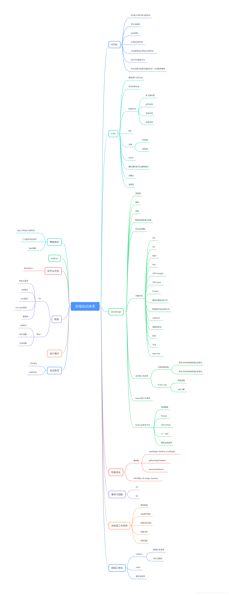

## 前言
  前端知识多而杂，今天学习一点点这个知识模块，明天学习一点点那个知识模块，不容易记忆，且前端的更新实在是块，日新月异，扶老夫起来，老夫还能学。。。这样的情况下拥有自己的前端只是体系就显得尤为重要了，还要多去了解框架底层的一些东西，不能只停留在使用某个框架的阶段，得去了解它们的原理，结构，这样就可以做到 他强任他强，清风拂山岗，我自岿然不动。

  从今天起就要塑造自己的前端知识体系，做到在前端迅猛的潮流下不至于被淹没。对于前端开发者，不像后端开发人员科班出身的那么多，主要是因为前端这些知识在学校基本没有相关课程，这就可能会导致自学或者培训班出来的前端开发者较多，但是一个人的能力不是由科班与否决定的，也不在于你拥有什么什么的技术，而是在于你的大脑中有没有自己从事工作的完整的知识体系。

  摘抄一下某大佬文章里的一段话：

  拥有自己知识体系是很重要的，这份知识体系相当于是你大脑中的操作系统，有了这个系统，用当今比较时髦的词来形容就是有了体系化的思考能力，在应对复杂的问题才会站在更高的高度对各个方面才去综合性的权衡和取舍，或者在应对新技术的时候有足够的自信和能力去快速拿下，让这个系统更加坚固，总之这个系统会在很长一段时间伴随和影响自己，如果不好好建设一下，如蜻蜓点水一般随便学一堆技术栈，或者三天打鱼两天晒网，没有持续学习的毅力，结果就是大脑中相当于缺少一个完整的操作系统，其实也是挺可悲的一件事情。以前的我总是对各种技术栈趋之若鹜没恨不得掌握所有的技术栈，因此也总是因为时间不够、效果不好二焦虑。最后的结论就是：从一开始关注点就错了，关注点不应该在于眼花缭乱的技术，而在于自身系统的建设，这样就不会为某某技术我不会而感到焦虑了，相反反而会为自己点滴的顿悟和进步感到兴奋和满足。

  文章链接：https://juejin.im/post/5dd8b3a851882572f56b578f

  很庆幸自己很早就看到了这篇文章，对我的启发很大，让我在眼花缭乱的技术中找到了属于自己的灯塔。

  下面是目前制定的一份简单粗略的知识体系脑图，虽然里面的大部分都已经点亮，但是作者所知还是甚少，而且如果细细回想，还是会有种提笔忘字的感觉，还是要重新整理一份相关文章，加深理解与记忆，后面还会慢慢增加前端知识体系树干的枝叶，扩大知识体系，作者的危机感还是挺强额，对于自身的原地踏步是极难容忍的，希望能记录自己成长的足迹，多年后不因荒度光阴而捶胸顿足。
  
  ## 目录
  [HTML它不香吗](./HTML篇.md)  
  待续。。。
